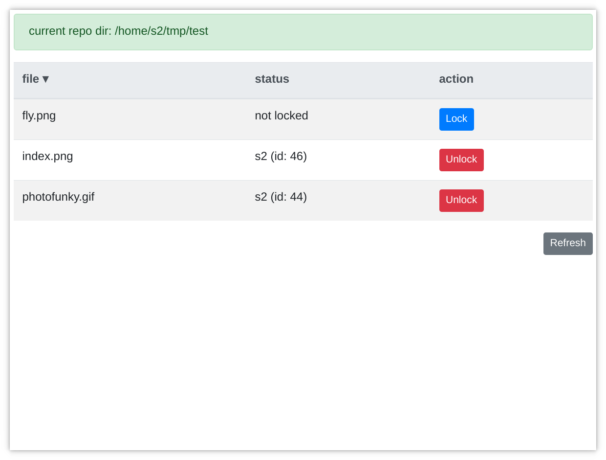

# 

gitlit is a very simple desktop app that allows you to handle [git lfs file locks](https://github.com/git-lfs/git-lfs/wiki/File-Locking).



## download

Just go to releases and download the version for your platform.

## usage

gitlit takes one command line argument: the git repository directory on your filesystem you want to handle the locks for.

So if you want to look at the locked files on the `/home/s2/myApp` directory, run gitlit like this:
```
gitlit /home/s2/myApp
```

If no folder is specified, gitlit looks at the current path.

You can also drag&drop a folder inside the main window.

## contribute

The code is very easy. Just clone the repo and have look!
Use the `.eslintrc.json` for formatting the code and keep it clean and consistent.

There are just some js libraries:
- [ejs](http://ejs.co/) is used for templating. The templates are in `app/js/templates.js`.
- [sorttable.js](http://www.kryogenix.org/code/browser/sorttable/) to sort the table containing the files.
- [jQuery](https://jquery.com/), because it's still cool to have it, even if everyone says it's dead and we should do without.
- [Bootstrap](https://getbootstrap.com/) for the layout
- [PNotify](https://github.com/sciactive/pnotify) for generic notifications

### run the app
```
npm install
npm start
```

### make a release
```
npm install
npm run dist
```

## license

ISC
